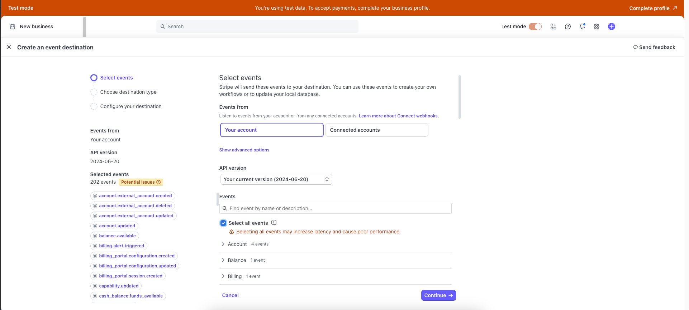
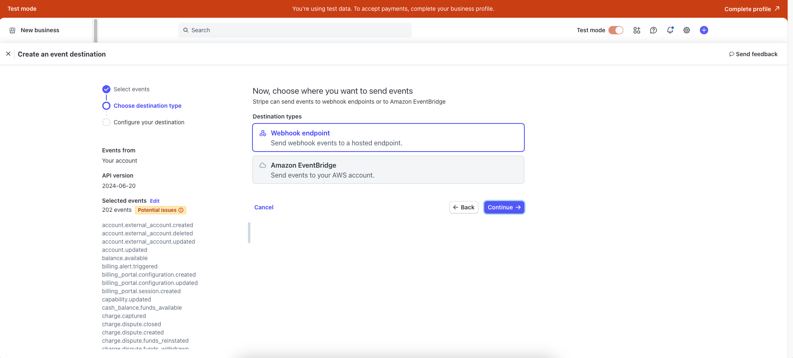
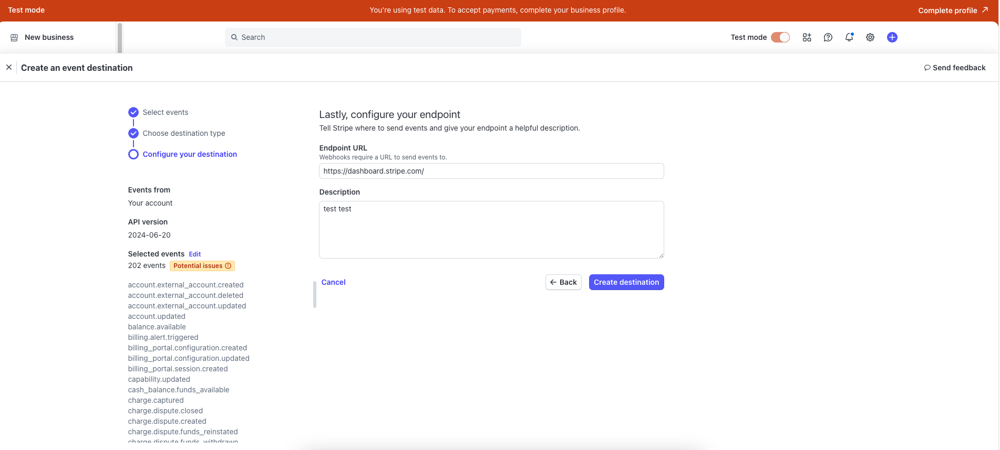
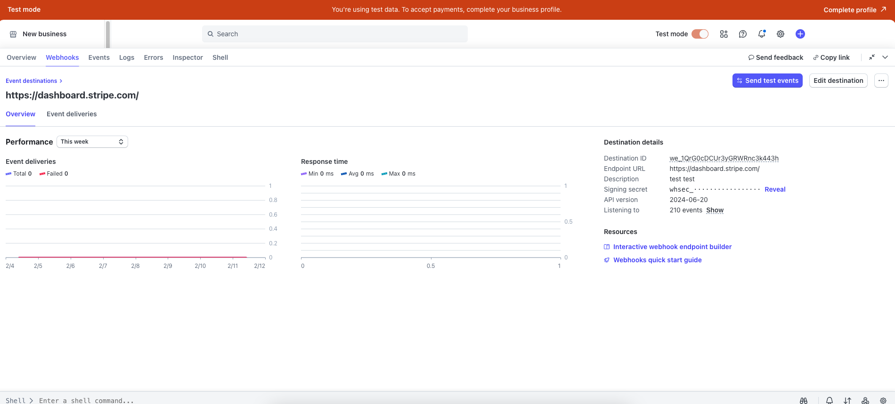
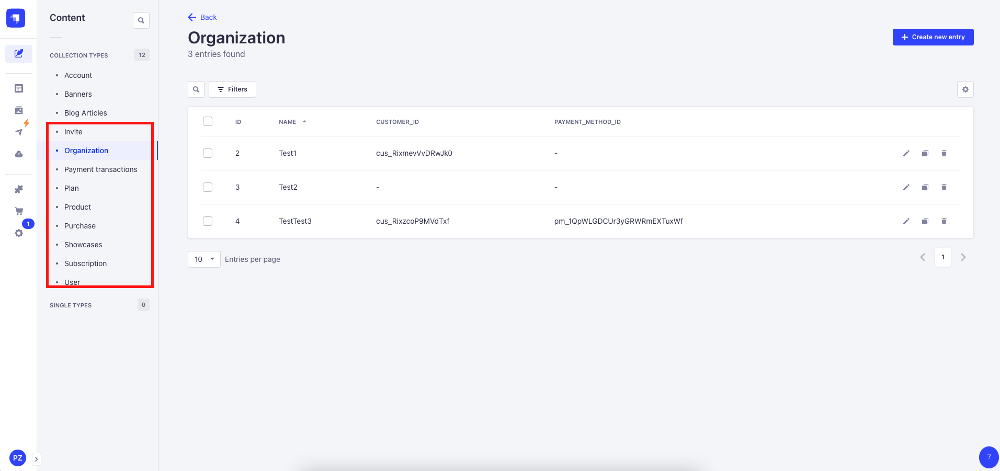
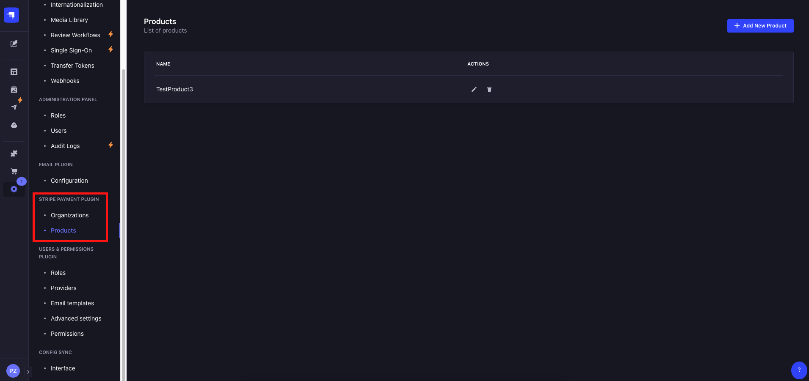

# Strapi Plugin: Stripe Payment

## Introduction

The Stripe Payment plugin for Strapi enables seamless integration with the Stripe payment system. This plugin is
inspired by GitHub's payment system for organizations, allowing users to create organizations, subscribe to plans, and
manage their subscriptions. Administrators can create and manage products, plans, and subscriptions within the Strapi
admin panel.

## How to Use

This plugin facilitates Stripe integration within your Strapi application, providing user and admin-facing
functionalities. Users can subscribe to different plans, manage their billing details, and handle payments via Stripe.
The administrator can configure products; and pricing plans; and oversee user subscriptions.

## Installation

To install the plugin, run the following command:

```bash
  yarn add @dbbs/strapi-plugin-stripe-payment
```

### Plugin Configuration

Enable and configure the Stripe Payment plugin in `plugins.ts`:

```ts
'stripe-payment': {
  enabled: true
}
```

### Environment Variables Setup

Configure the required environment variables in your `.env` file:

```env
STRIPE_API_KEY=your_stripe_secret_key
STRIPE_WEBHOOK_SECRET=webhook_secrete_key
STRIPE_SUCCESS_PAYMENT_URL=your_success_url
STRIPE_SUCCESS_SETUP_URL=your_success_setup_url
```

`server.ts` file:

```typescript
export default ({ env }) => ({
  stripe: {
    apiKey: env('STRIPE_API_KEY', ''),
    successPaymentUrl: env('STRIPE_SUCCESS_PAYMENT_URL', 'http://localhost:8080/success'),
    successSetupUrl: env('STRIPE_SUCCESS_SETUP_URL', 'http://localhost:8080/success'),
    webhookSecret: env('STRIPE_WEBHOOK_SECRET', ''),
    domainUrl: env('DOMAIN_URL', '')
  }
})
```

## Connecting Services

To use this plugin, you need to have two services set up:

### Stripe (Payment System)

1. Go to [Stripe](https://stripe.com/) and sign up/log in.
2. Navigate to the **Developers** section and obtain your **Secret Key**.
3. Go to the **Webhook** section and create a new webhook route.
   [Tutorial](https://docs.itstripe.com/tutorial/setting-up-webhook/)

    - Open `create event destinagtion` on stripe dashboard and pick events for new webhook
      

    - Choose `webhook` option (for now, the plugin supports webhook)
      

    - Provide stripe with your webhook url
      

    - Save your webhook secret key
      

4. Copy the **Webhook Secret Key** and add it to your `.env` file.

## Admin panel

On the admin panel, you can use 2 new paragraphs in **Settings** and **Content Manager**

### Content manager page

On this page, you can do base CRUD operations for entities in your DB, **without Stripe sync**. This way, you can
integrate your entities with the plugin.

- Content Manager 

### Settings page

On this page, you can perform manipulations with Stripe: do CRUD operations, manage entities, and make purchases; and
subscriptions
**with Stripe sync**.

- Settings 

### API

We can present our **REST API**, which allows your customers to manipulate Stripe via our plugin. Customers can create
organizations, add other users to organizations, make purchases and transactions, and subscribe to products with
specified plan types.

#### Content types

Here you can see the main entities that allow your customers to manipulate Stripe; you can collaborate your entities
with the presented and extend the user’s logic as you want.

##### Organization

In our plugin terminology – a group of users, with one leader user – the owner, allows to sharing subscriptions or other
rules between users. On `stripe` side, our organization is `stripe-customer`

The organization fields

| Attribute           | Type                 | Description                                                             |
|---------------------|----------------------|-------------------------------------------------------------------------|
| `id`                | number               | Unique organization id in database                                      |
| `name`              | string               | Name of the organization                                                |
| `customer_id`       | string               | Stripe customer ID associated with the organization                     |
| `payment_method_id` | string               | Stripe payment method ID for the organization                           |
| `owner_id`          | string               | User ID of the organization's owner                                     |
| `users`             | relation (oneToMany) | List of users in the organization (linked to `users-permissions.user`)  |
| `subscription`      | relation (oneToOne)  | Subscription linked to the organization (linked to `subscription`)      |
| `purchases`         | relation (oneToMany) | Purchases made by the organization (linked to `purchase`)               |
| `quantity`          | integer              | Quantity related to the organization's subscription or purchases        |
| `transactions`      | relation (oneToMany) | Transactions associated with the organization (linked to `transaction`) |

#### Plan

A plan or billing plan is an entity that describes how organizations should pay for products; it can be a one-time
purchase
or a monthly/yearly subscription.

| Attribute   | Type                 | Description                                                    |
|-------------|----------------------|----------------------------------------------------------------|
| `id`        | number               | Unique plan ID in database                                     |
| `price`     | integer              | Price of the plan in smallest currency unit (e.g., cents)      |
| `stripe_id` | string               | Stripe plan ID associated with this plan                       |
| `interval`  | enumeration          | Billing interval: `month`, `year`                              |
| `type`      | enumeration          | Plan type: `recurring` (default) or `one-time`                 |
| `product`   | relation (manyToOne) | Linked product associated with this plan (linked to `product`) |

##### Product

A product is an item that organizations can purchase or subscribe to. The product can have its own price and plan type
on the
Stripe side, but you can make it more functional by adding new fields and logic on your side.

| Attribute   | Type                 | Description                                             |
|-------------|----------------------|---------------------------------------------------------|
| `id`        | number               | Unique product ID in database                           |
| `name`      | string               | Name of the product                                     |
| `stripe_id` | string               | Stripe product ID associated with this product          |
| `plans`     | relation (oneToMany) | List of plans linked to this product (linked to `plan`) |

##### Purchase

We have 2 kinds of payments - one-time and periodic. If an organization needs to buy a product with a one-time plan,
that will be a purchase. Organization, as we saw above, can have multiple purchases.

| Attribute      | Type                 | Description                                                    |
|----------------|----------------------|----------------------------------------------------------------|
| `id`           | number               | Unique purchase ID in database                                 |
| `stripe_id`    | string               | Stripe purchase ID associated with this purchase               |
| `plan`         | relation (oneToOne)  | Linked plan for this purchase (linked to `plan`)               |
| `organization` | relation (manyToOne) | Organization that made the purchase (linked to `organization`) |

##### Subscription

Periodic payment is a subscription that can withdraw money in a specified
time period. Instead of purchases, an organization can have only one subscription, and it should replace an existing
subscription if it wants a new one.

| Attribute      | Type                | Description                                                         |
|----------------|---------------------|---------------------------------------------------------------------|
| `id`           | number              | Unique subscription ID in database                                  |
| `stripe_id`    | string              | Stripe subscription ID associated with this subscription            |
| `organization` | relation (oneToOne) | Organization linked to this subscription (linked to `organization`) |
| `plan`         | relation (oneToOne) | Plan linked to this subscription (linked to `plan`)                 |
| `status`       | enumeration         | Subscription status: `trialing`, `active`, `cancelled`, `paused`    |

##### Transaction

The transaction is an entity that describes how the payment was processed, as all payments need to be recorded.
Transactions can be associated with purchases and subscriptions. An organization can have multiple transactions as
purchases.

| Attribute             | Type                 | Description                                                        |
|-----------------------|----------------------|--------------------------------------------------------------------|
| `id`                  | number               | Unique transaction ID in database                                  |
| `subscriptionId`      | integer              | ID of the subscription associated with the transaction             |
| `organization`        | relation (manyToOne) | Organization linked to the transaction (related to `organization`) |
| `purchaseId`          | integer              | ID of the purchase associated with the transaction                 |
| `status`              | enumeration          | Transaction status: `pending`, `completed`, `failed`               |
| `externalTransaction` | json                 | Data from the external payment system (e.g., Stripe)               |

#### User routes

| Method | Endpoint                                                     |
|--------|--------------------------------------------------------------|
| POST   | /stripe-payment/api/organizations                            |
| GET    | /stripe-payment/api/organizations/:id                        |
| GET    | /stripe-payment/api/organizations/:id/default-payment-method |
| PUT    | /stripe-payment/api/organizations/:id                        |
| DELETE | /stripe-payment/api/organizations/:id                        |
| PATCH  | /stripe-payment/api/organizations/:id/owner                  |
| PATCH  | /stripe-payment/api/organizations/:id/users                  |
| PATCH  | /stripe-payment/api/organizations/:id/remove-user            |
| PATCH  | /stripe-payment/api/organizations/:id/default-payment-method |
| GET    | /stripe-payment/api/plans/:id                                |
| POST   | /stripe-payment/api/subscriptions/checkout-session           |
| GET    | /stripe-payment/api/subscriptions/:id                        |
| GET    | /stripe-payment/api/subscriptions                            |
| PATCH  | /stripe-payment/api/subscriptions/:id/pause                  |
| PATCH  | /stripe-payment/api/subscriptions/:id/cancel                 |
| PATCH  | /stripe-payment/api/subscriptions/:id/resume                 |
| DELETE | /stripe-payment/api/subscriptions/:id                        |
| PATCH  | /stripe-payment/api/subscriptions/:id                        |
| PATCH  | /stripe-payment/api/subscriptions/:id/resubscribe            |
| GET    | /stripe-payment/api/products                                 |
| GET    | /stripe-payment/api/products/:id                             | |
| GET    | /stripe-payment/api/transactions                             |

#### Webhook

| Method | Endpoint                    |
|--------|-----------------------------|
| POST   | /stripe-payment/api/webhook |

## License

DBBS Strapi-stripe payment is open-source software licensed under the [MIT License](LICENSE).

## Authors

- [andrii-dbb](https://github.com/andrii-dbb)
- [pavlozhurbytskyi](https://github.com/pavlozhurbytskyi)
- [akho-dbb](https://github.com/akho-dbb)

## Links

- [DBB-Software](https://dbbsoftware.com/)
- [Strapi Documentation](https://docs.strapi.io)
- [Strapi Plugins](https://strapi.io/plugins)
- [Stripe](https://stripe.com)
- [TypeScript](https://www.typescriptlang.org)
- [Linting Best Practices](https://eslint.org/)

